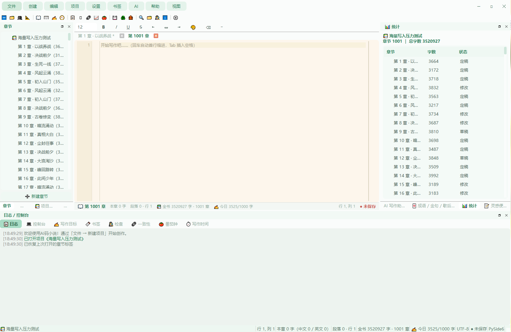
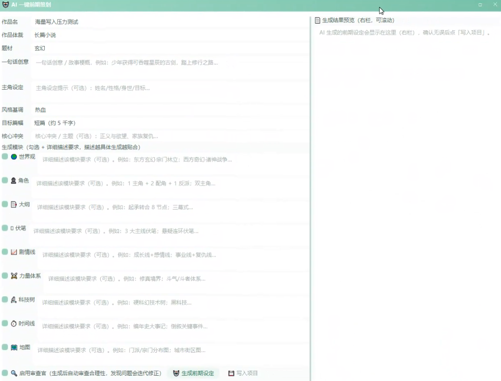
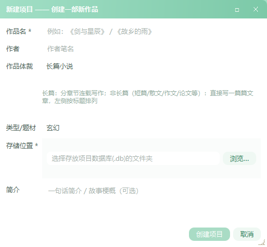
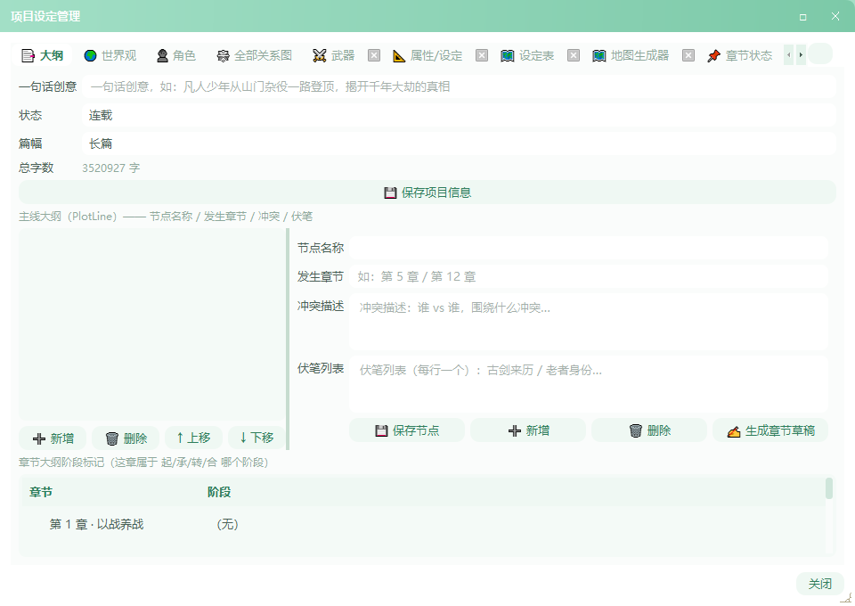
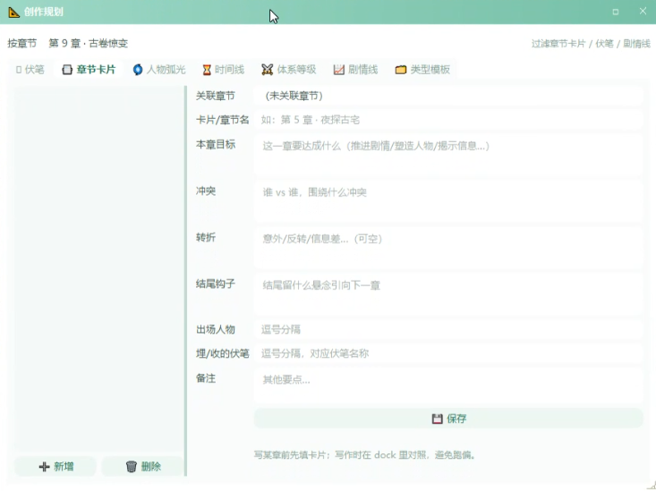
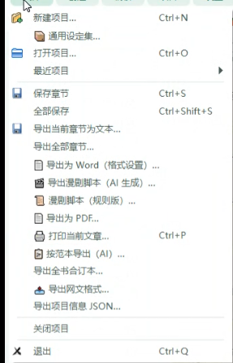
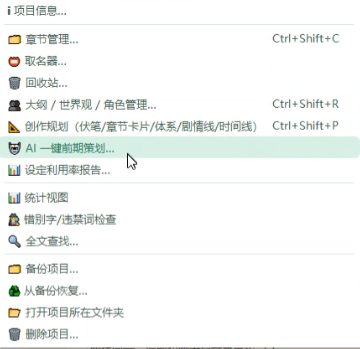
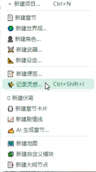

# AI码小说（原小说编辑器）

一个面向中文写作者的桌面写作软件，基于 **Python + PySide6** 开发。
界面参考 VS / VSCode：可停靠浮窗、多标签编辑器、底部日志与控制台。
内置**小清新主题**（薄荷绿 + 圆角柔和风格，另有护眼绿/墨蓝/羊皮纸主题，见 `app/theme.py`）。

## 📸 界面截图

| 主界面 | AI 创作 |
|---|---|
|  |  |

| 新建项目 | 章节管理 |
|---|---|
|  |  |

| 项目设定管理 | 创作规划 |
|---|---|
|  |  |

| 文件菜单 | 项目菜单 | 记录灵感 |
|---|---|---|
|  |  |  |

## ✨ 功能总览

| 区域 | 说明 |
|---|---|
| **主界面** | VS 风格：菜单栏、工具栏、左侧章节 dock、右侧 AI 面板、底部日志/控制台、中心多标签编辑器 |
| **写小说** | VSCode 式编辑器：行号、当前行高亮、**回车自动首行缩进**、**Tab 转空格**、实时字数统计、**GBK/UTF-8 编码**、人名自动补全、一键段落整理、回收站（软删除+恢复）、打字机模式、智能标点、段落快捷键 |
| **作品体裁** | 新建项目可选体裁：长篇小说章节制 / 短篇 / 散文 / 作文论文 / 学术 / 其他文章篇制，界面术语与功能随体裁自动适配 |
| **章节管理** | 左侧章节列表（新建/删除/上下移/拖拽排序），状态（待写/草稿/修改/定稿）与起承转合阶段标记 |
| **项目设定管理** | 大纲 / 世界观 / 角色 / 武器 / 属性 / 地图 / 自定义模块（含流行模板：金手指系统/师徒绑定/百倍返还等）多标签管理 |
| **创作规划** | 章节卡片、伏笔（埋设/回收）、剧情线、力量体系、时间线等规划模块 |
| **AI 写作** | 右侧面板对话（多轮记忆）→ 调用 OpenAI 兼容接口 → 一键插入；技能/作者身份/全书设定作为全局 AI 参数可开关 |
| **AI 一键前期策划** | 按体裁生成完整设定（世界观/角色/大纲/伏笔/剧情线/力量体系/时间线/地图），审查官迭代修正，一键写入项目 |
| **AI 生成章节** | 按本章卡片（目标/冲突/转折/钩子）与上一章结尾生成章节草稿，可保存 |
| **全文搜索** | 跨章节搜索，双击结果跳转并高亮定位；按人物（角色）快捷检索 |
| **导出** | Word（格式设置/按范本一比一/页眉页脚/列表）、PDF、打印、文本、网文格式、漫剧分镜脚本（AI 生成 + 审查官） |
| **语音输入** | 本地/云端 Whisper 识别，AI 润色口语转正文 |
| **数据安全** | SQLite 本地存储（`~/.novel_editor/`）、自动备份、Git 版本管理、崩溃恢复上次标签 |
| **隐私** | 严格隐私模式默认开启（AI 不上传文本），全书设定注入需作者同意 |

## 🚀 快速上手

```bash
pip install -r requirements.txt
python main.py
```

1. 启动后点「➕ 新建项目」：填写书名、作者、类型 → 自动创建 `书名.db` 并新建第一章。
2. 左侧章节列表单击打开章节，开始写作（回车自动缩进，字数实时统计，Ctrl+S 保存）。
3. 写作时可用右侧 **AI 写作助手** 对话/润色/续写；「项目 → AI 一键前期策划」可先让 AI 生成全书设定。
4. 「文件 → 导出为 Word/PDF」或「导出漫剧脚本（AI 生成）」输出成品。

## 📱 安卓版（精简版）

`android_app/` 是基于 **Kivy + KivyMD** 的安卓精简版（独立 APK），保留核心能力：
- **写作**：新建/打开项目、章节列表、编辑器、字数统计、保存
- **管理**：章节增删、角色 / 世界观 / 大纲 / 自定义设定（可编辑）
- **AI**：一键生成全书设定（角色/世界观/大纲写入项目）、续写、润色（需自备 OpenAI 兼容 API）
- **导出**：全书 txt（安卓分享）

**安装**：从 GitHub **Releases** 下载 `AI码小说-*-arm64-v8a.apk`（近两年手机）或 `armeabi-v7a`（老机），手机安装时允许"未知来源"即可。

**打包**：无需本机环境，GitHub Actions 的 **Build Android APK** 云打包（推 `v*` 标签自动发布到 Releases）。

```
android_app/
├── main.py              App 入口（ScreenManager）
├── data/storage.py      数据层（SQLite，单库多项目）
├── ui/screens.py        六屏（项目/章节/编辑器/设定/AI/配置）
├── ai/client.py         OpenAI 兼容 API 客户端
├── tools/export.py      txt 导出 + 安卓分享
└── buildozer.spec       安卓打包配置
```

## 💾 数据存储

- 一个项目 = 一个 `.db` 文件（SQLite），存放于你选择的文件夹，方便备份/拷贝。
- 全局配置与技能/身份/备份/词库等保存在 `~/.novel_editor/`（打包版同样读取）。

## 📦 打包

### Windows

```bash
python -m PyInstaller --noconfirm --clean --onefile --windowed --name "AI码小说" \
  --icon "assets/icon.ico" --add-data "<绝对路径>\assets\icon.ico;assets" \
  --add-binary "%USERPROFILE%\miniconda3\DLLs\_sqlite3.pyd;." \
  --add-binary "%USERPROFILE%\miniconda3\Library\bin\sqlite3.dll;." \
  --collect-all app --collect-all docx --noupx \
  --distpath x64 --workpath build --specpath build main.py
```

### macOS（无需 Mac，GitHub Actions 云打包）

1. 推送代码后打标签：`git tag v1.0.0 && git push origin v1.0.0`
2. 仓库 Actions → **Build macOS App** 自动双架构打包
3. 完成后在 **Releases** 页下载 `AI码小说-macos-arm64.zip`（Apple 芯片）/ `AI码小说-macos-x64.zip`（Intel）

### 发布新版本（GitHub Release）

```bash
git add . && git commit -m "更新说明"
git push
git tag v1.1.0          # 版本号自定，v 开头
git push origin v1.1.0  # 推送标签 → 自动触发 macOS 打包并发布 Release
```

## 📁 目录结构

```
main.py                  程序入口
app/
├── main_window.py       主窗口（菜单/工具栏/dock/标签/状态栏）
├── editor.py            VSCode 式编辑器组件
├── ai_panel.py          AI 写作辅助面板
├── models.py            数据模型
├── storage.py           SQLite 存储层
├── config.py            配置读写
├── theme.py             主题样式
└── dialogs/             各功能弹窗（新建项目/章节管理/设定管理/设置/漫剧导出/AI 前期策划…）
shots/                   界面截图
tools/                   打包与测试工具
```
